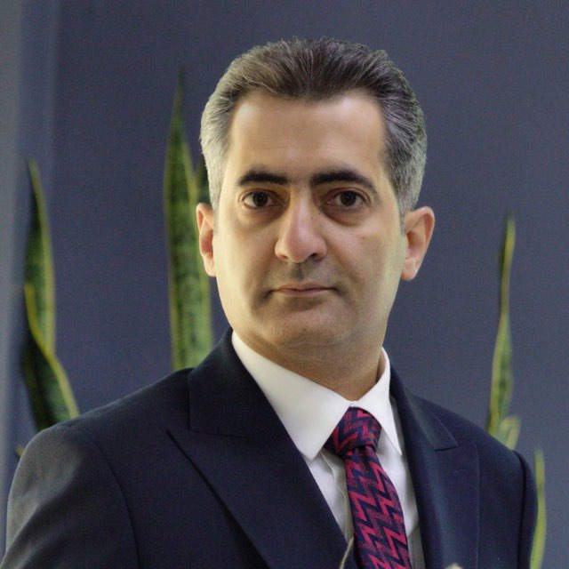

<table>
<tr>
<td width="70%" valign="top">

# Farshid Mokhtarinezhad
### Machine Learning Engineer · Data Scientist

Senior ML Engineer and Data Scientist with 5+ years of focused ML experience and 10+ years in engineering. Ships production ML systems end-to-end — ranking models, retrieval pipelines, and LLM-based agents — with a track record at enterprise scale.

📍 Canada · [LinkedIn](https://www.linkedin.com/in/mokhtarinezhad/)

</td>
<td width="30%" valign="top">

</td>
</tr>
</table>

---

## About

I specialize in machine learning systems that go to production: ranking and retrieval, risk modeling, anomaly detection, and agentic LLM pipelines. My work spans the full ML lifecycle — designing the system, building feature and retrieval pipelines, evaluating offline and online, and operating in production.

At RBC I built Sage-Avert, a two-stage ranking system that processes over 140,000 production change requests per year and drove a ~30% reduction in major change-related incidents. Currently at 247Labs, I'm architecting an agentic RAG pipeline for regulated insurance workflows. My toolkit spans gradient-boosted trees and transformer-based encoders on the modeling side, LangChain and LangGraph for agent orchestration, and Airflow, Docker, and Weights & Biases for the MLOps layer.

---

## Experience

### 247Labs · Senior AI Engineer
**Apr 2026 – Present · Toronto, Canada**

- Designing and building an LLM-based agentic RAG system to automate insurance claim triage at Guardme Insurance, replacing manual operator workflows for ~60–70K claims annually.
- Architecting retrieval pipelines over historical claims and the OHIP code ontology, with agent tooling, guardrails, and auditability controls for a regulated environment.
- Defining the path to production deployment, model monitoring, and continuous evaluation.

### Royal Bank of Canada (RBC) · Senior Data Scientist / Technical Lead (ML & AIOps)
**Jan 2023 – Mar 2025 · Toronto, Canada**

- Architected and shipped **Sage-Avert**, an enterprise two-stage ranking and triage system processing 10,000+ production change requests per month (~140K/year); drove a ~30% reduction in major change-related incidents.
- Built candidate generation using semi-supervised PU learning with anomaly detection and XGBoost; re-ranking using supervised XGBoost with score-based selection under fixed reviewer capacity.
- Delivered **IPM (Incident Prediction Model)** generating predictive alerts across 50+ application codes using telemetry data, abnormality scores, and historical incident patterns.
- Led a cross-functional team of 7 across data science, data engineering, MLOps, and UI; owned roadmap, prioritization, and technical direction.

### Stream ML · Lead Data Scientist
**Mar 2022 – Dec 2022 · Remote, Canada**

- Owned end-to-end ML product development in direct partnership with CEO and CTO.
- Built image classification pipelines with selectable architectures (ResNet, VGG16) and object detection and crowd-counting models delivered as containerized services.
- Built end-to-end ML infrastructure: ingestion, preprocessing, training, containerized deployment, and monitoring.

### FarazMed · Data Scientist
**Jan 2019 – Aug 2020 · Remote**

- Developed NLP models for Named Entity Recognition (NER) and sentiment analysis on client datasets.
- Designed and implemented ML pipelines covering preprocessing, training, evaluation, and inference.

### Afta · Head of ICS Security, Isfahan Province
**Sep 2015 – Oct 2018 · Isfahan, Iran**

- Led ICS security governance across 15 government organizations; managed two internal auditing teams.

### AraminIT · Head of Network Development
**Jun 2010 – Aug 2013 · Iran**

- Managed a team of 5 network engineers delivering secure network infrastructure projects end-to-end.

---

## Featured Projects

### Agentic RAG Contract Analyzer
LLM-based agent pipeline for automated contract analysis and structured information extraction. Retrieval over document corpora via vector search, tool-augmented reasoning with LangGraph agents, and structured output for downstream processing.

**Stack**: Python · LangChain · LangGraph · vector search · Docker

[View on GitHub →](https://github.com/mokhtarinezhad/contract_analyzer_agentic_rag)

---

## Tech Stack

**Languages**

**ML / DL**

**LLMs & Agents**

**MLOps**

---

## Currently

Building agentic RAG pipelines for regulated, high-volume document workflows and deepening work on LLM evaluation frameworks and retrieval quality at scale.

---

## Connect

[LinkedIn](https://www.linkedin.com/in/mokhtarinezhad/)
